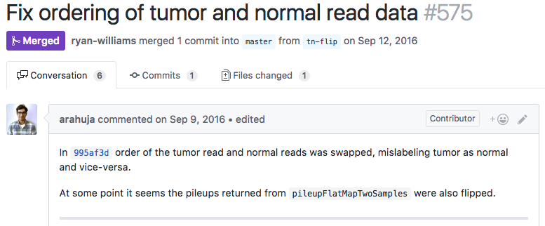
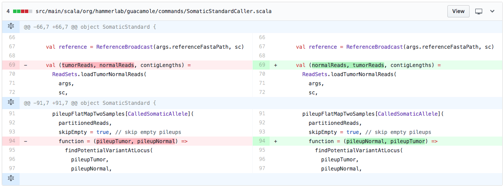

layout: true
name: title-slide
class: middle, title-slide

---
# The trouble with argument-passing

<br/>

HammerLab Lunch & Learn

<br/>

July 12, 2017

Ryan Williams

---
layout: true
name: main-slides
class: main-slide

---
name: hardest-problem
class: pad-h2-bottom
## The hardest problem in bioinformatics

--
.img-container[
]

--
.img-container[
]

---
template: hardest-problem
--
- don't mix up order of arguments

--
- in particular, normal/tumor samples

---
layout: false
class: divider-slide, middle
# Toy example, various languages

---
layout: true
class: main-slide

---
# v0: no types
--

## Python
--
name: python_example
param1: sample_id
param2: sample_name

```python
def get_records({{param1}}, {{param2}}):
  …

```
--
comment: 
first_arg: sample_id
second_arg: sample_name

```python
def main():

  sample_id   = prompt("Sample ID: ")
  sample_name = prompt("Sample name: ")

  {{comment}}
  records = get_records({{first_arg}}, {{second_arg}})

```
--
param1: `sample_id`
param2: `sample_name`
first_arg: `sample_name`
second_arg: `sample_id`
--
class: oops-comment
comment: # oops!
.banner.oops[
OOPS ]

---

# v1: put some types on it
--

## Java
--

```java
void getRecords(`String sampleId`, `String sampleName`) { 
  … 
}
```
--
comment: 

```java
void main() {
  String sampleId   = prompt("Sample ID: ");
  String sampleName = prompt("Sample name: ");

  {{comment}}
  ArrayList<…> records = getRecords(`sampleName`, `sampleId`);
}
```

--
class: oops-comment
comment: // Still oops!
.banner.oops[
STILL OOPS ]

---

# v1.1: put some types on it
--

## Scala
--

```
def getRecords(`sampleId: String`, `sampleName: String`): Unit = { 
  … 
}
```
--
comment: 

```
def main(): Unit = {
  val sampleId  : String = prompt("Sample ID: ")
  val sampleName: String = prompt("Sample name: ")

  {{comment}}
  val records = getRecords(`sampleName`, `sampleId`)  
}
```

--
class: oops-comment
comment: // Still oops!
.banner.oops[
STILL OOPS ]

---
name: named-args
# v2: named arguments

--
## Python
--
extra_args: ):

```python
def get_records(sample_id, sample_name{{extra_args}}
  …
```
--
class: hide-line-10, hide-line-11
timestamp:
comment: 
sample_id:   `sample_id = sample_name`
sample_name: `sample_name = sample_id`
line10:
line11:
first_line:

```python
def main():
  {{first_line}}
  sample_id   = prompt("Sample ID: ")
  sample_name = prompt("Sample name: ")
  {{timestamp}}
  {{comment}}
  records = get_records(
    {{sample_id}} 
    {{sample_name}}
    {{line10}}
    {{line11}}
  )
```
--
class: meh-comment
comment: # oops?
banner: OOPS?
.banner.meh[
{{banner}}]
--
comment:
banner: 
sample_id:   sample_id   = sample_id,    
sample_name: sample_name = sample_name   
--
class: normal-comment-weight
sample_id:   sample_id   = sample_id,
sample_name: sample_name = sample_name   # ok, fine
--
class: show-line-10
sample_name: sample_name = sample_name,  # ok, fine
line10:      timestamp   = timestamp     # we type everything twice here
timestamp:   timestamp   = time.time()
--
extra_args: , timestamp):  # and once up here
--
class: show-line-11
line10:      timestamp   = timestamp,    # we type everything twice here
line11:      run_id      = run_id        # but maybe there is a better way…
first_line:  run_id      = query_database()
---
template: named-args
name: scala-named-args
## Scala
--

```
def getRecords(`sampleId: String`, `sampleName: String`): Unit = { 
  … 
}
```
--
comment: 

```
def main(): Unit = {
  val sampleId  : String = prompt("Sample ID: ")
  val sampleName: String = prompt("Sample name: ")

  {{comment}}
  val records = getRecords(
    `sampleId = sampleName`, 
    `stringName = sampleId`
  )
}
```

--
class: meh-comment
comment: // oops?
.banner.meh[
OOPS?]

---
template: scala-named-args
[Seen in the wild](https://github.com/hammerlab/guacamole/blob/9d330aeb3a7a040c174b851511f19b42d7717508/src/main/scala/org/hammerlab/guacamole/commands/GermlineAssemblyCaller.scala#L63-L75):

--
minAreaVaf: minAreaVaf = args.minAreaVaf / 100.0f
discoverGermlineVariants: discoverGermlineVariants
```
val calledAlleles =
  {{discoverGermlineVariants}}(
    partitionedReads,
    args.sampleName,
    kmerSize = args.kmerSize,
    assemblyWindowRange = args.assemblyWindowRange,
    minOccurrence = args.minOccurrence,
    {{minAreaVaf}},
    reference = reference,
    minMeanKmerQuality = args.minMeanKmerQuality,
    minPhredScaledLikelihood = args.minLikelihood,
    shortcutAssembly = args.shortcutAssembly
  )
```
--
Two (trivial) things happening here:

--
minAreaVaf: `minAreaVaf = args.minAreaVaf / 100.0f`
1. convert a percentage to a `Double`

--
minAreaVaf: minAreaVaf = args.minAreaVaf / 100.0f
discoverGermlineVariants: `discoverGermlineVariants`
2. call .highlight-inline-code[`discoverGermlineVariants`] with obvious arguments


--
boilerplate: 
but you'd hardly know by looking at it! {{boilerplate}}

--
boilerplate: So much boilerplate!

---
template: named-args
--
## Java
--
.banner.oops[
OOPS]

---
name: kwargs
# v3: kwargs

--
## Python

--
```python

def get_records(`**kwargs`):
  `sample_id`   = `kwargs['sample_id']`
  `sample_name` = `kwargs['sample_name']`
  …
```
--
comment: 

```python
def main():

  sample_id   = prompt("Sample ID: ")
  sample_name = prompt("Sample name: ")

  {{comment}}
  records = get_records(
    `sample_id = sample_name`, 
    `sample_name = sample_id` 
  )
```

--
class: meh-comment
comment: # oops?
.banner.meh[
OOPS?]

--
class: flatten-unify-ul
- .flat[ Scala 🤔]

--
- .flat[ Java 🤔]

---
template: kwargs

--
## Javascript
--
class: line-height-code-13
args: `args`
body: let { `sample_id`, `sample_name` } = args;
comment: 
passed: `sample_name`, `sample_id`
fn_comment: 

```javascript
function get_records({{args}}) {  {{fn_comment}}
  {{body}}
}
```
--

```javascript
function main() {

  let sample_id   = prompt("Sample ID: ");
  let sample_name = prompt("Sample name: ");

  {{comment}}
  records = get_records({ {{passed}} });
}
```

--
name: JS-kwargs
class: good-comment
comment: // 😎 ✅
emoji: 😎 ✅

.banner.oops[
{{emoji}}]

---
template: JS-kwargs
name: js-kwargs-commentary
class: flatten-unify-ul
args: `{ sample_id, sample_name }`
body: …
fn_comment: // 🎉 🙌

--
emoji: 

Imagine JavaScript, but:

--
class: highlight-inline-code
- always call functions with `({`, `})` instead of `(`, `)`

--
- always declare functions with `({`, `})` instead of `(`, `)`

--
- no more argument order!

---
template: js-kwargs-commentary
args: { sample_id, sample_name }
passed: sample_name, sample_id
emoji: &nbsp;
Just one problem…

--
still no compiler!

--
class: oops-comment
args: { sample_id, `sample_name` }
passed: `sample_namez`, sample_id
emoji: OOPS
comment: // oops!
fn_comment: 

---
class: line-height-code-11
heading: v4: "Value Classes"
sampleId: case class `SampleId`  (sampleId  : String)
sampleName: case class `SampleName`(sampleName: String)

# {{heading}}

--
```
{{sampleId}}
{{sampleName}}
```

--
sampleId: case class SampleId  (sampleId  : String)
sampleName: case class SampleName(sampleName: String)
sampleIdParam: `SampleId`
sampleNameParam: `SampleName`

```
def getRecords(sampleId: {{sampleIdParam}}, sampleName: {{sampleNameParam}}): Unit = { 
  … 
}
```

--
sampleIdParam: SampleId
sampleNameParam: SampleName
sampleIdTypeDecl: `SampleId`
sampleNameTypeDecl: `SampleName`
eqnew: =
firstArg: sampleId
secondArg: sampleName
comment: 

```
def main(): Unit = {
  val sampleId   {{eqnew}} {{sampleIdTypeDecl}}(prompt("Sample ID: "))
  val sampleName {{eqnew}} {{sampleNameTypeDecl}}(prompt("Sample name: "))

  {{comment}}
  val records = getRecords({{firstArg}}, {{secondArg}})  
}
```

--
name: value-classes
class: good-comment
sampleIdParam: `SampleId`
sampleNameParam: `SampleName`
sampleIdTypeDecl: SampleId
sampleNameTypeDecl: SampleName
firstArg: `sampleName`
secondArg: `sampleId`
comment: // Compile error!

.banner.good[
🎉 COMPILE ERROR! 🎉]

--
heading: v4.1: Value Classes
sampleId: class SampleId  (val sampleId  : String) `extends AnyVal`
sampleName: class SampleName(val sampleName: String) `extends AnyVal`
eqnew: = `new`
sampleIdParam: SampleId
sampleNameParam: SampleName
firstArg: sampleName
secondArg: sampleId

- [scala-lang.org: Value Classes](http://docs.scala-lang.org/overviews/core/value-classes.html)

--
- unboxed at runtime; compiler unrolls to enclosed "value"

--
- easy to end up boxing though

--
- `case class`es often easier to use

---
name: dry-base
class: line-height-code-11, good-comment
sampleId:   `sampleId`  :
sampleName: `sampleName`:
sampleIdVal:   `sampleId`  : `SampleId`   =
sampleNameVal: `sampleName`: `SampleName` =

# DRY

```
class `SampleId`  (val {{sampleId}} String) extends AnyVal
class `SampleName`(val {{sampleName}} String) extends AnyVal
```

```
def getRecords(`sampleId`: `SampleId`, `sampleName`: `SampleName`): Unit = { 
  … 
}
```

```
def main(): Unit = {
  val {{sampleIdVal}} new `SampleId`(prompt("Sample ID: "))
  val {{sampleNameVal}} new `SampleName`(prompt("Sample name: "))

  // Compile error!
  val records = getRecords(`sampleName`, `sampleId`)  
}
```

--
- `/SampleId/i`: 8x
- `/SampleName/i`: 8x

---
name: dry-deduped
template: dry-base
sampleId:   value:
sampleName: value:
sampleIdVal:   `sampleId`   =
sampleNameVal: `sampleName` =

--
- `/SampleId/i`: 6x
- `/SampleName/i`: 6x

--
- can we do better?

---
class: line-height-code-11
# v5: Implicits

--
SampleIdDecl:   SampleId  (
SampleNameDecl: SampleName
```
case class {{SampleIdDecl}}value: String)
case class {{SampleNameDecl}}(value: String)
```

--
i: `implicit`
body: …
sampleIdParam: sampleId
sampleIdParamType: SampleId
sampleNameParam: sampleName
sampleNameParamType: SampleName

```
def getRecords({{i}} {{sampleIdParam}}: {{sampleIdParamType}}, {{sampleNameParam}}: {{sampleNameParamType}}): Unit = { 
  {{body}}
}
```

--
class: good-comment
sampleIdVal:   sampleId   =
sampleNameVal: sampleName =
SampleIdInstance:   SampleId  (
SampleNameInstance: SampleName
comment:
getRecords:

```
def main(): Unit = {
  {{i}} val {{sampleIdVal}} {{SampleIdInstance}}prompt("Sample ID: "))
  {{i}} val {{sampleNameVal}} {{SampleNameInstance}}(prompt("Sample name: "))

  {{comment}}
  {{getRecords}}
}
```

--
name: implicits-full-1
comment: // No args! ⟹ compiler does the right thing automatically! 😎
getRecords: val records = getRecords
--

.koolaid[

]

---
template: implicits-full-1
name: implicits-bullets-1
count: false
i: implicit
--
sampleIdVal:   `sampleId`   =
sampleNameVal: `sampleName` =
sampleIdParam: `sampleId`
sampleNameParam: `sampleName`
- variable names: what are they good for?

--
  - ≈nothing?

--
sampleIdVal: `_1` =
sampleNameVal: `_2` =
--
sampleIdParam: `_3`
sampleNameParam: `_4`
body: // pass Sample{Id,Name} implicitly, or materialize with "implicitly"
--
  - put that info in types!

---
template: implicits-bullets-1
name: implicits-bullets-2
count: false
sampleIdVal: _1 =
sampleNameVal: _2 =
sampleIdParam: _3
sampleNameParam: _4
--
SampleIdDecl:   `SampleId`  (
SampleNameDecl: `SampleName`
sampleIdParamType:   `SampleId`
sampleNameParamType: `SampleName`
SampleIdInstance:   `SampleId`  (
SampleNameInstance: `SampleName`
--
Redundancy check:

--
- `/SampleId/i`: 3x
- `/SampleName/i`: 3x


--
Seems minimal for this example:

--
sampleIdParamType:   SampleId
sampleNameParamType: SampleName
SampleIdInstance:   SampleId  (
SampleNameInstance: SampleName
- declare

--
SampleIdDecl:   SampleId  (
SampleNameDecl: SampleName
SampleIdInstance:   `SampleId`  (
SampleNameInstance: `SampleName`
- instantiate

--
sampleIdParamType:   `SampleId`
sampleNameParamType: `SampleName`
SampleIdInstance:   SampleId  (
SampleNameInstance: SampleName
- receive

--
SampleIdDecl:   `SampleId`  (
SampleNameDecl: `SampleName`
sampleIdParamType:   `SampleId`
sampleNameParamType: `SampleName`
SampleIdInstance:   `SampleId`  (
SampleNameInstance: `SampleName`
.floating-bottom-right[
"as few as possible,
<br/>
and no fewer!"]

---
template: implicits-bullets-2
count: false
name: scala-bullets
c: :
Scala implicits point toward new patterns{{c}}

--
- for dramatically reducing boilerplate

--
- and certain kinds of errors

--
- by eliminating parameter-passing!

---
template: scala-bullets
c:
clunky: 
- but… {{clunky}}

--
clunky: clunky in Scala today

--
- need:

--
  - {partial, multiple} implicit parameter lists

--
  - omit variable names altogether

--
  - actively being researched for Scala 3.x ("[Dotty](http://dotty.epfl.ch/)")

---
class: line-height-code-12
# v6: best of all possible worlds

--
Imaginary language:

--
```
// algebraic data types defined by constituent field-types
class SampleId   { String }
class SampleName { String }
```

--
path:
lines:
record:
records:
```
def getRecords(SampleId, SampleName) {
  {{path}}
  {{lines}}
  {{record}}
  {{records}}
}
```
--
path: Path(SampleId / SampleName)  // construct a filesystem path to read from
--
lines: Lines                        // reads "implicit" Path, emits list of "Line"s
--
record: Line⇒Record(…)             // define how to turn a Line into a record
--
records: Records                      // make 'Records' from {Lines, 'Line⇒Record'}
--
```
def main(): Unit = {
  SampleId  (prompt("Sample ID: "))
  SampleName(prompt("Sample name: "))
  getRecords  // needs SampleId, SampleName; has SampleId, SampleName
}
```
--
default:
- no variable names {{default}}

--
default: (by default)
--
default2:
- no argument-passing {{default2}}

--
default2: (by default)
--
  - compiler routes arguments to proper destinations by type

---
# Aside: [Unison](http://unisonweb.org/2015-05-07/about.html)

--
- Scala/Haskell person's attempt at a new programming ~~language~~ *paradigm* 

--
- typed by construction, default global namespace auto-completable by type

--
  .unison-gif[
  &nbsp;]

---
class: line-height-code-12, code-cols-slide

## Aside: separating code form, function

--
Alice and Bob are working in the same codebase:

--
sp1: (1
sp2: (2
sp10: (10
cs1: , 1
cs3: , 3
cs4: , 4
leftArrowT: -> t
leftArrow: ->
rightArrow: ->
rightLeadingComma: 
rightTrailingComma: ,
leftTrailingComma: ,
folded: 
Position: Position
Pos: Position
PosImport: Position
expectedLeft: expected
expectedRight: expected

.left-code-col.code-col[
```
import com.foo.{{Position}}
def check({{expectedLeft}}: List[{{Position}}]) {
  {{expectedLeft}} should be(
    {{Position}}{{sp1}}{{cs1}}0) {{leftArrow}} false{{leftTrailingComma}}
    {{Position}}{{sp2}}, 1107) {{leftArrowT}}rue{{leftTrailingComma}}
    {{Position}}{{sp10}}{{cs4}}2) {{leftArrow}} false{{leftTrailingComma}}
    {{Position}}(222{{cs3}}33) {{leftArrowT}}rue
  )
}
```]

.right-code-col.code-col[
```
import com.foo.{{PosImport}}
def check({{expectedRight}}: List[{{Pos}}]) {
  {{expectedRight}} should be( {{folded}}
    {{Pos}}(1, 10) {{rightArrow}} false{{rightTrailingComma}}
    {{rightLeadingComma}}{{Pos}}(2, 1107) {{rightArrow}} true{{rightTrailingComma}}
    {{rightLeadingComma}}{{Pos}}(10, 42) {{rightArrow}} false{{rightTrailingComma}}
    {{rightLeadingComma}}{{Pos}}(222, 333) {{rightArrow}} true
  )
}
```]

--
name: code-cols-base
today: Today…
.clear-both[
{{today}}]
--
class: alternate-syntax-colors
- they are free to view the same code with different color schemes

--
colorscheme: - color-scheme is not saved to version control, just local editor settings
  {{colorscheme}}

--
name: pre-folding
codefolding: - likewise: code-folding
configure: - developers can configure them independently from one another
  {{configure}}

--
class: code-cols-folding
folded: `…` )
{{codefolding}}

---
template: pre-folding
{{codefolding}}

--
- why not the same for:

--
sp1: (`  `1
sp2: (`  `2
sp10: (` `10
cs1: , `  `1
cs3: , ` `3
cs4: , `  `4
leftArrowT: -> ` `t
leftTrailingComma: `,`
rightLeadingComma: `,`
rightTrailingComma:
  - whitespace

--
sp1: (  1
sp2: (  2
sp10: ( 10
cs1: ,   1
cs3: ,  3
cs4: ,   4
leftTrailingComma: ,
rightLeadingComma: ,
leftArrow: `→`
leftArrowT: `→`  t
rightArrow: `->`
  - unicode shorthands

--
leftArrow: →
leftArrowT: →  t
rightArrow: ->
Position: `Position`
Pos: `Pos`
PosImport: { `Position ⇒ Pos` }
  - arbitrary import names/renames

--
Position: Position
Pos: Pos
PosImport: { Position ⇒ Pos }
expectedLeft: `expected`
expectedRight: `exp`
class: ul-no-margin-bottom
  - **variable names**?!

---
layout: false
class: center, middle, main-slide

# 🏁
