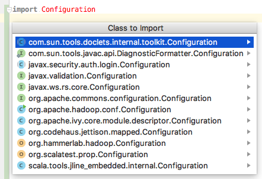

layout: true
name: title-slide
class: center, middle, title-bg-sinai

---
# #deepthoughts about types

HammerLab Lunch & Learn

July 12, 2017

Ryan Williams

---
layout: true
name: main-slides
class: main-slide

---

# The hardest problem in bioinformatics

--
.pad-top[
]

--
- also: some confusion around this in Isaac's farewell L&L, adding delly2 to biokepi+TTFI

---

# v0: no types
--

## Python
--
name: python_example

```python

def get_records(sample_id, sample_name):
  …

```
--

```python
def main():

  sample_id   = prompt("Sample ID: ")
  sample_name = prompt("Sample name: ")

  records = get_records(sample_id, sample_name)

```
---
count: false
template: python_example

```python
def main():

  sample_id   = prompt("Sample ID: ")
  sample_name = prompt("Sample name: ")

  # oops!
  records = get_records(`sample_name`, `sample_id`)

```

--
.oops[
OOPS ]

---

# v1: put some types on it
--

## Java
--

```java
void getRecords(`String sampleId`, `String sampleName`) { 
  … 
}
```
--

```java
void main() {
  String sampleId   = prompt("Sample ID: ");
  String sampleName = prompt("Sample name: ");

  // Still oops!
  ArrayList<…> records = getRecords(`sampleName`, `sampleId`);
}
```

--
.oops[
STILL OOPS ]

---

# v1.1: put some types on it
--

## Scala
--

```
def getRecords(`sampleId: String`, `sampleName: String`): Unit = { 
  … 
}
```
--

```
def main(): Unit = {
  val sampleId  : String = prompt("Sample ID: ")
  val sampleName: String = prompt("Sample name: ")

  // Still oops!
  val records = getRecords(`sampleName`, `sampleId`)  
}
```

--
.oops[
STILL OOPS ]

---
name: named-args
# v2: named arguments

--
## Python
--

```python

def get_records(sample_id, sample_name):
  …

```
--

```python
def main():

  sample_id   = prompt("Sample ID: ")
  sample_name = prompt("Sample name: ")

  # oops?
  records = get_records(
    `sample_id = sample_name`, 
    `sample_name = sample_id`
  )

```

--
.meh[
OOPS?]

---
template: named-args
## Scala
--

```
def getRecords(`sampleId: String`, `sampleName: String`): Unit = { 
  … 
}
```
--

```
def main(): Unit = {
  val sampleId  : String = prompt("Sample ID: ")
  val sampleName: String = prompt("Sample name: ")

  // oops?
  val records = getRecords(
    `sampleId = sampleName`, 
    `stringName = sampleId`
  )
}
```

--
.meh[
OOPS?]

--

.overlay[
```
      val calledAlleles =
        discoverGermlineVariants(
          partitionedReads,
          args.sampleName,
          kmerSize = args.kmerSize,
          assemblyWindowRange = args.assemblyWindowRange,
          minOccurrence = args.minOccurrence,
          minAreaVaf = args.minAreaVaf / 100.0f,
          reference = reference,
          minMeanKmerQuality = args.minMeanKmerQuality,
          minPhredScaledLikelihood = args.minLikelihood,
          shortcutAssembly = args.shortcutAssembly
        )
```
]

---
template: named-args
--
## Java
--
.oops[
OOPS]

---
name: kwargs
# v3: kwargs

--
## Python

--
```python

def get_records(`**kwargs`):
  `sample_id`   = `kwargs['sample_id']`
  `sample_name` = `kwargs['sample_name']`
  …
```
--

```python
def main():

  sample_id   = prompt("Sample ID: ")
  sample_name = prompt("Sample name: ")

  # oops?
  records = get_records(
    `sample_id = sample_name`, 
    `sample_name = sample_id` 
  )
```

--
.meh[
OOPS?]

--
- .flat[ Scala 🤔]

--
- .flat[ Java 🤔]

---
template: kwargs

--
## Javascript
--
args: `args`
body: let { `sample_id`, `sample_name` } = args;
emoji: 😎 ✅
passed: `sample_name`, `sample_id`
fn_comment: 

```javascript
function get_records({{args}}) {  {{fn_comment}}
  {{body}}
}
```
--

```javascript
function main() {

  let sample_id   = prompt("Sample ID: ");
  let sample_name = prompt("Sample name: ");

  // {{emoji}}
  records = get_records({ {{passed}} });
}
```

--
name: JS-kwargs

.oops[
{{emoji}}]

---
template: JS-kwargs
args: `{ sample_id, sample_name }`
body: …
fn_comment: // 🎉 🙌

--

- catch: still no compiler…

--
args: { sample_id, sample_name }
passed: sample_name`z`, sample_id
emoji: OOPS
fn_comment: 

---
heading: v4: "Value Classes"
sampleId: case class SampleId  (sampleId  : String)
sampleName: case class SampleName(sampleName: String)
eqnew: =
sampleIdParam: `SampleId`
sampleNameParam: `SampleName`
sampleIdArg: `sampleId`
sampleNameArg: `sampleName`

# {{heading}}

--
```
{{sampleId}}
{{sampleName}}
```

--
```
def getRecords(sampleId: {{sampleIdParam}}, sampleName: {{sampleNameParam}}): Unit = { 
  … 
}
```

--
```
def main(): Unit = {
  val sampleId  : SampleId   {{eqnew}} SampleId(prompt("Sample ID: "))
  val sampleName: SampleName {{eqnew}} SampleName(prompt("Sample name: "))

  // Compile error!
  val records = getRecords({{sampleIdArg}}, {{sampleNameArg}})  
}
```

--
name: value-classes

.good[
🎉 COMPILE ERROR! 🎉]

---
template: value-classes
heading: v4.1: Value Classes
sampleId: class SampleId  (val sampleId  : String) `extends AnyVal`
sampleName: class SampleName(val sampleName: String) `extends AnyVal`
eqnew: = `new`
sampleIdParam: SampleId
sampleNameParam: SampleName
sampleIdArg: sampleId
sampleNameArg: sampleName

.footnote[ 
[scala-lang.org: Value Classes](http://docs.scala-lang.org/overviews/core/value-classes.html)]

---
# DRY

```
class `SampleId`  (val `sampleId`  : String) extends AnyVal
class `SampleName`(val `sampleName`: String) extends AnyVal
```

```
def getRecords(`sampleId`: `SampleId`, `sampleName`: `SampleName`): Unit = { 
  … 
}
```

```
def main(): Unit = {
  val `sampleId`  : `SampleId`   = new `SampleId`(prompt("Sample ID: "))
  val `sampleName`: `SampleName` = new `SampleName`(prompt("Sample name: "))

  // Compile error!
  val records = getRecords(`sampleName`, `sampleId`)  
}
```

---
count: false

# DRY
```
class `SampleId`  (val value: String) extends AnyVal
class `SampleName`(val value: String) extends AnyVal
```

```
def getRecords(`sampleId`: `SampleId`, `sampleName`: `SampleName`): Unit = { 
  … 
}
```

```
def main(): Unit = {
  val `sampleId`   = new `SampleId`  (prompt("Sample ID: "))
  val `sampleName` = new `SampleName`(prompt("Sample name: "))

  // Compile error!
  val records = getRecords(`sampleName`, `sampleId`)  
}
```

---
# v5: Implicits

--
```
case class SampleId  (value: String)
case class SampleName(value: String)
```

--
i: `implicit`
body: …
sampleIdParam: sampleId
sampleNameParam: sampleName

```
def getRecords({{i}} {{sampleIdParam}}: SampleId, {{sampleNameParam}}: SampleName): Unit = { 
  {{body}}
}
```

--
name: implicits-full-1
sampleIdVal:   sampleId   =
sampleNameVal: sampleName =

```
def main(): Unit = {
  {{i}} val {{sampleIdVal}} SampleId  (prompt("Sample ID: "))
  {{i}} val {{sampleNameVal}} SampleName(prompt("Sample name: "))

  // No args! 😎
  val records = getRecords
}
```

--

.good[

]

---
template: implicits-full-1
i: implicit
sampleIdVal: `_1` =
sampleNameVal: `_2` =

--
sampleIdParam: `_3`
sampleNameParam: `_4`
body: // pass Sample{Id,Name} implicitly, or materialize with "implicitly"

--
nothing: 
- variable names: what are they good for? {{nothing}}

--
nothing: (nothing?)
--
nothing: (nothing? use types!)
--
name: scala-bullets
- Scala implicits point toward new patterns

--
  - for dramatically reducing boilerplate

--
  - and certain kinds of errors

--
  - by eliminating parameter-passing!

---
template: scala-bullets

--
- But such patterns are a bit clunky in Scala today

--
  - {partial, multiple} implicit parameter lists

--
  - omit variable names altogether

--
  - actively being researched for Scala 3.x ("[Dotty](http://dotty.epfl.ch/)")

---
# v6: best of all possible worlds

--
Imaginary language:

--
```
class SampleId   { String }
class SampleName { String }
```

--
path:
lines:
record:
records:
```
def getRecords(SampleId, SampleName) {
  {{path}}
  {{lines}}
  {{record}}
  {{records}}
}
```
--
path: Path(SampleId / SampleName)  // construct a filesystem path to read from
--
lines: Lines                        // uses "implicit" Path, generates List of "Line"s
--
record: Line⇒Record(…)             // define how to turn a Line into a record
--
records: Records                      // make 'Records' from {Lines, 'String⇒Record'}
--
```
def main(): Unit = {
  SampleId  (prompt("Sample ID: "))
  SampleName(prompt("Sample name: "))

  getRecords
}
```

---
# [Unison](http://unisonweb.org/2015-05-07/about.html)

--
- Scala/Haskell person's attempt at a new programming ~~language~~ *paradigm* 

--
- typed by construction, default global namespace auto-completable by type

--


---
# `import`s are a lie

--
- … in Java/Scala

--
  - can be side-effect-ful in Python, OCaml, JavaScript(?)

--
  - but specific names of imports generally fungible, in spirit

--
- wanted: better editor/view layers over underlying code

--
  - "style guides" ⟶ "style sheets (for code)"

--
    - "code style": that which relates to *form*, doesn't affect *function*

--
    - exactly the things that shouldn't need to be shared between developers, committed to version control, etc.

--
class: line-height-code

.left-col[
```
import com.foo.Position
def check(expected: List[Position]) {
  expected should be(
    Position( 1,  10) → false,
    Position( 2, 107) →  true,
    Position(10,  42) → false,
    Position(22, 333) →  true
  )
}
```]

--
.right-col[
```
import com.foo.{ Position ⇒ Pos }
def check(expected: List[Pos]) {
  expected should be(
    Pos(1, 10) -> false,
    Pos(2, 107) -> true,
    Pos(10, 42) -> false,
    Pos(22, 333) -> true
  )
}
```]

---
All of these programs are the same, with different import/aliasing:

```
import java.net.URI
import java.nio.file.{ Paths, Files }
val path = Paths.get(new URI("gs://hammerlab/foo.txt"))
val is = Files.newInputStream(path)
```

```
val path = java.nio.file.Paths.get(new java.net.URI("gs://hammerlab/foo.txt"))
val is = java.nio.file.Files.newInputStream(path)
```

```
import java.net.URI
import java.nio.file.Files.newInputStream
import java.nio.file.Paths.get
val path = get(new URI("gs://hammerlab/foo.txt"))
val is = newInputStream(path)
```

```
import java.net.{ URI ⇒ A }
import java.nio.file.{ Paths ⇒ B, Files ⇒ C }
val path = B.get(new A("gs://hammerlab/foo.txt"))
val is = C.newInputStream(path)
```

---
# Observation: `import`s are a lie

.pad[
Unambiguous basenames are nice when they exist, but reality is fully-qualified]



---
layout: false
# Also: style guides

No reason two people working in the same codebase couldn't simultaneously view the same block of code in the following two ways:

```
import java.nio.file.{ Files, Path }

def mergeFiles(path1: Path, path2: Path, out: Path): Unit = {
    if (Files.exists(path1) && Files.exists(path2)) {
        Files.write(Files.read(path1) + Files.read(path2), out)
    } else {
        throw PathDoesntExistException()
    }
}
```

```
import java.nio.file.{ Path => P }
import java.nio.file.Files.{ exists, read, write }

def mergeFiles(path1: P,
               path2: P,
               out: P): Unit =
  if (
    exists(path1) && 
    exists(path2)
  )
    write(
      read(path1) + read(path2),
      out
    )
  else
    throw PathDoesntExistException
```

---
class: center, fin

# 👍🏼
